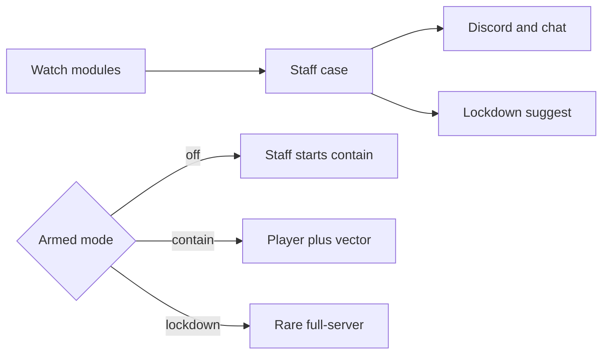

Halt watches Bukkit-level signals, writes a staff case, and alerts. It does not act on the player until you arm it or you start containment by hand.



## Unarmed (default)

First boot is `containment.mode: off`. Halt:

1. Records a signal (CrashGuard, DupeWatch, MineWatch, FreecamWatch)
2. Creates or correlates an incident
3. Updates risk scores
4. Alerts staff chat, console, and Discord (when configured)
5. Suggests a lockdown profile on CRITICAL (`lockdown.suggest_on_critical`)

It never auto-starts player containment or server lockdown while unarmed. You still run `/halt lockdown economy` or `/halt contain <player>` yourself.

Keep unarmed Halt as the **staff case layer** packet tools and combat ACs do not provide.

## Armed `contain`

`/halt arm contain` or `/halt setup contain` writes `containment.mode: contain` and reloads.

On HIGH/CRITICAL (see `containment.min_severity`), Halt auto-restricts:

- The **suspect player** (economy commands, containers, drops, shulkers)
- The **matching mechanic** (for example a hopper burst can globally block hopper transfer)

That is reversible. It is still not a ban. Optional `containment.kick_on_critical` kicks **that player** after containment starts.

## Armed `lockdown`

`/halt arm lockdown` is the same as contain, plus rare full-server `full_containment` when the incident is CRITICAL **and** already correlated with another signal. Uncorrelated CRITICAL still contains the player/vector. It does not dump the whole server into lockdown on a single flag.

## Correlation and risk

`incident_correlation` links same-player OPEN incidents within `window_seconds` for `link_types` via `parent_id`. Related hopper, value-growth, and mining signals become one staff case instead of a spam of rows.

Risk scores decay and are what `/halt scan <player>` shows. They are triage, not proof.

## Grim / Vulcan ingest

When those plugins are present and `integrations.grim_ingest` / `vulcan_ingest` are true, their flag events can become Halt incidents. Missing plugins are ignored. Halt still does not replace the combat anticheat.

## Reverse

```text
/halt contain off
/halt contain off <player>
/halt contain off all
/halt lockdown off
/halt arm off
```

Do not leave lockdown or containment on after the incident is controlled. See the [Incident playbook](/halt/playbook) and [Containment](/halt/containment).
