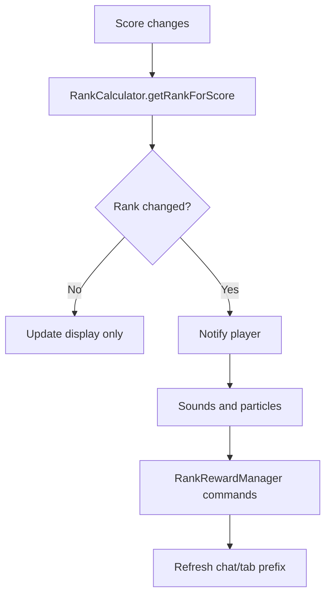

Each rank in Rep is defined by a **score threshold** in `config.yml`. When a player's reputation score changes, Rep compares the new score against every threshold and assigns the matching rank.

## What `score-threshold` means

Under `ranks`, each tier has three fields:

```yaml title="plugins/Rep/config.yml"
ranks:
  known:
    name: Known
    score-threshold: 50
    chat-prefix: "&e[Known]"
```

| Field | Purpose |
| --- | --- |
| `name` | Display name shown in messages, GUIs, and `%rep_rank%` |
| `score-threshold` | Tier boundary — the score that defines when this rank applies |
| `chat-prefix` | Prefix for chat, tab list, and `%rep_prefix%` (supports `&` color codes) |

The `score-threshold` is **not** a range. It is a boundary Rep uses to decide which single rank a player belongs to.

## Assignment rules

Rep uses different logic for negative and non-negative scores:

**Scores 0 or higher:** the player gets the **highest** rank whose threshold they meet (`score >= threshold`). Think of each positive threshold as the **minimum score to enter** that tier.

**Scores below 0:** the player gets the **smallest** threshold `T` where `score <= T`. Think of each negative threshold as the **upper bound** of that negative band.

## Worked examples

With the default rank ladder:

| Rank | Threshold |
| --- | --- |
| Outcast | −100 |
| Stranger | 0 |
| Known | 50 |
| Respected | 150 |
| Honored | 300 |

| Score | Assigned rank | Why |
| --- | --- | --- |
| −101 | Outcast | −101 ≤ −100 (negative-band rule) |
| −50 | Stranger | −50 ≤ 0, and 0 is the smallest matching threshold |
| 0 | Stranger | 0 ≥ 0 |
| 49 | Stranger | 49 ≥ 0 but 49 < 50 |
| 50 | Known | 50 ≥ 50 |
| 149 | Known | 149 ≥ 50 but 149 < 150 |
| 300 | Honored | 300 ≥ 300 |

## Default config example

```yaml title="plugins/Rep/config.yml"
ranks:
  outcast:
    name: Outcast
    score-threshold: -100
    chat-prefix: "&4[Outcast]"

  stranger:
    name: Stranger
    score-threshold: 0
    chat-prefix: "&7[Stranger]"

  known:
    name: Known
    score-threshold: 50
    chat-prefix: "&e[Known]"

  respected:
    name: Respected
    score-threshold: 150
    chat-prefix: "&a[Respected]"

  honored:
    name: Honored
    score-threshold: 300
    chat-prefix: "&b[Honored]"
```

## Rules for admins

- List thresholds in **ascending order** (lowest to highest). Rep logs a warning if they are out of order.
- You can add as many ranks as you need.
- When a player crosses into a new rank, Rep can notify them, play sounds and particles, run rank reward commands, and refresh their chat/tab prefix.
- Configure rank rewards under `rank-rewards` in [Configuration](/rep/configuration).

## What happens when a threshold is crossed



## Where players see ranks and thresholds

| Location | What they see |
| --- | --- |
| `/rep check` | Current score and rank name |
| `/rep rewards` GUI | Required score per rank, locked/unlocked status |
| Chat | Rank prefix after the player name (when `general.use-chat-prefix` is enabled) |
| Tab list | Rank prefix (when `general.use-tab-prefix` is enabled) |
| PlaceholderAPI | `%rep_rank%` and `%rep_prefix%` |

## Rank thresholds vs compact score formatting

<Note>
`placeholders.compact.thresholds` in config controls **number formatting** for placeholders like `%rep_score_compact%` (when to show `1k`, `1m`, etc.). It does **not** affect rank assignment. Only `ranks.*.score-threshold` controls which rank a player has.
</Note>

## Next steps

- Tune thresholds and prefixes in [Configuration](/rep/configuration)
- Set up rank reward commands for tier changes
- Use [Placeholders](/rep/placeholders) to show rank and score in other plugins
